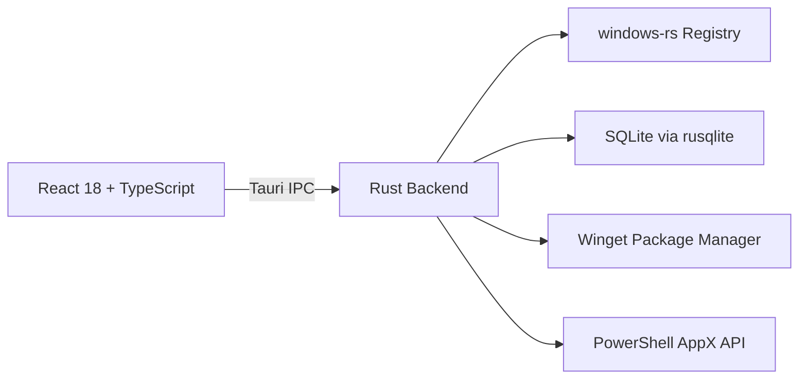

<p align="center">
  
  
  
  
  
</p>

<p align="center">
  
  
  
  
</p>

---

# ZingerBoost

### Safe, Reversible, Transparent &mdash; Windows Optimization Done Right

**ZingerBoost** is a modern, professional Windows optimization utility that puts **safety first**. Built with **Rust + Tauri v2**, it provides a beautiful dark-mode interface to apply safe, reversible tweaks, install essential software, and remove bloatware &mdash; all without breaking your system.

> **Every tweak is reversible. Every change is logged. Nothing is hidden.**

---

##  Philosophy

| Principle | Meaning |
|-----------|---------|
| **Safety first** | Stability over raw performance. Never break Windows functionality. |
| **Always reversible** | Every tweak captures previous state. One click to undo. |
| **Complete transparency** | See exactly what registry key changed and why. |
| **No bullshit** | No fake "speed boost" numbers. No RAM cleaners. No adware. |
| **Zero telemetry** | No network calls except opt-in update check. Fully offline. |

---

##  Features

###  10 Safe Tweaks

| # | Tweak | Category |
|---|-------|----------|
| 1 | **Disable Transparency Effects** &mdash; Reduce GPU compositor load | Visual |
| 2 | **Disable Window Animations** &mdash; Snappier minimize/maximize | Visual |
| 3 | **Disable Sticky Keys Popup** &mdash; No Shift&times;5 interruptions | Visual |
| 4 | **Show File Extensions** &mdash; Security best practice | Visual |
| 5 | **Disable Game DVR** &mdash; Free CPU/GPU while gaming | Gaming |
| 6 | **Disable Background Apps** &mdash; Stop UWP background processes | Privacy |
| 7 | **Disable Telemetry (Basic)** &mdash; Minimum diagnostic data | Privacy |
| 8 | **Disable Startup Delay** &mdash; Apps launch immediately | Performance |
| 9 | **Disable Hibernation** &mdash; Free disk space = RAM size | Performance |
| 10 | **High Performance Power Plan** &mdash; Prevent CPU downclocking | Performance |

###   Snapshots &amp; Restore

- Automatic state capture before every tweak
- Full rollback to any previous snapshot
- SQLite-backed persistence at `%LOCALAPPDATA%\ZingerBoost\`
- 50-snapshot retention with auto-purge
- Detailed audit log of every operation

###   Software Installer &amp; Debloat

| Feature | Description |
|---------|-------------|
| **Install Apps** | 30+ essential apps across 8 categories via Winget |
| **Remove Bloatware** | 21 pre-installed Windows apps safely removed |
| **Protected Apps** | Notepad, Calculator, Store, Photos, Camera, Terminal &mdash; never removed |
| **Reinstall Safely** | Everything can be reinstalled from Microsoft Store at any time |

###  Software Categories

| Category | Available Apps |
|----------|---------------|
| **Browsers** | Chrome, Firefox, Brave, Opera |
| **Media Players** | VLC, Spotify, iTunes, MPV |
| **Gaming** | Steam, Epic Games, Riot Client, Discord, OBS Studio, GOG Galaxy |
| **Utilities** | 7-Zip, Notepad++, Everything Search, ShareX |
| **Drivers** | NVIDIA GeForce Experience, AMD Adrenalin |
| **Communication** | Telegram, Zoom, Slack |
| **Development** | VS Code, Git, Python, Node.js |
| **Cloud Storage** | Google Drive, Dropbox, MEGA |

---

##  Architecture

```
ZingerBoost/
│
├── src-tauri/              ← Tauri v2 desktop entry point
│   ├── src/main.rs         ← Binary: wires up all crates
│   ├── tauri.conf.json     ← Window config, build settings
│   └── capabilities/       ← Security permissions
│
├── crates/                 ← Rust workspace
│   ├── zb_shared/          Common types, errors, software catalog
│   ├── zb_domain/          Tweak trait, entities, 10 implementations
│   ├── zb_application/     TweakEngine, SnapshotService, AuditService
│   ├── zb_infrastructure/  WinRegistryProvider, SQLite, Winget, Metrics
│   └── zb_app/             Command handlers, AppState
│
├── src/                    ← React frontend
│   ├── components/ui/      Sidebar, ToastContainer
│   ├── features/           Dashboard, Tweaks, Snapshots, Software, Settings
│   └── lib/api.ts          Typed Tauri invoke wrappers
│
└── .github/workflows/      CI: fmt → clippy → test → build
```

### Tech Stack



| Layer | Technology |
|-------|-----------|
| **Desktop Shell** | Tauri v2 (Wry renderer) |
| **Backend** | Rust 2021 Edition |
| **Frontend** | React 18 + TypeScript + Vite |
| **Styling** | Tailwind CSS 3.4 (dark theme) |
| **Animations** | Framer Motion |
| **State** | Zustand (UI) + TanStack Query (server) |
| **Database** | SQLite (bundled) |
| **IPC** | Tauri Commands (typed JSON) |

---

##  Quick Start

### Prerequisites

- **Windows 10/11** (64-bit)
- **Rust** &mdash; [rustup.rs](https://rustup.rs/)
- **Node.js 22+** &mdash; [nodejs.org](https://nodejs.org/)
- **Microsoft Visual C++ Build Tools** (for `windows-rs` compilation)

### One-Command Setup

```powershell
git clone https://github.com/YousefMohiey/ZingerBoost.git
cd ZingerBoost
npm install
cargo tauri dev
```

### Build for Release

```powershell
npm install
cargo tauri build
```

Outputs: `src-tauri/target/release/bundle/msi/ZingerBoost_0.1.0_x64_en-US.msi`

---

##  Screenshots

> *Coming soon &mdash; screenshots of the dark-mode dashboard, tweak browser, debloat panel, and settings page*

---

##  Risk Levels

| Level | Color | Behavior |
|-------|-------|----------|
| **Safe** | `#10b981` Emerald | Toggle instantly, no confirmation needed |
| **Moderate** | `#f59e0b` Amber | Confirmation dialog, may require reboot |
| **Advanced** | `#ef4444` Red | Hidden behind Expert Mode, detailed warning |

---

##  Development

```bash
# Check cross-platform crates (Linux/macOS OK)
cargo check -p zb_shared -p zb_domain -p zb_application

# Run tests (cross-platform crates only)
cargo test -p zb_shared -p zb_domain -p zb_application

# Format code
cargo fmt --all

# Lint
cargo clippy -p zb_shared -p zb_domain -p zb_application -- -D warnings
```

> **Note:** `zb_infrastructure` and `zb_app` depend on `windows-rs` and only compile on Windows. The CI runs these on `windows-latest`.

---

##  Roadmap

| Version | Features |
|---------|----------|
| **v0.1.0**   | 10 safe tweaks, snapshot/restore, dark UI, SQLite, CI/CD |
| **v0.2.0**   | Winget installer, bloatware removal, real-time metrics via PDH |
| **v0.3.0**   | Gaming suite, network tweaks, benchmark system |
| **v0.5.0**   | Plugin SDK (WASM), community tweak repository |
| **v1.0.0**   | Enterprise support, localization, CLI mode |

---

##  Author

**YousefMohiey**

[](https://github.com/YousefMohiey)
[](mailto:yousefmohiey@gmail.com)

---

##  License

MIT &copy; 2026 YousefMohiey &mdash; Free forever, open source forever.
