<div align="center">



<br>

[](https://github.com/YousefMohiey/ZingerBoost/releases/latest)
[](https://github.com/YousefMohiey/ZingerBoost/releases)
[](LICENSE)
[![Stars](https://img.shields.io/github/stars/YousefMohiey/ZingerBoost?label=STARS&color=00ffc8&style=for-the-badge&logo=data:image/svg%2bxml;base64,PHN2ZyB4bWxucz0iaHR0cDovL3d3dy53My5vcmcvMjAwMC9zdmciIHdpZHRoPSIxNiIgaGVpZ2h0PSIxNiIgZmlsbD0iI2ZmZiIgY2xhc3M9ImJpIGJpLXN0YXIiPjxwYXRoIGQ9Ik0zLjYxMiAxNS40NDNjLS4zODYgMC0uNzAyLS4yMDEtLjkzMy0uNjE5YTUuNiA1LjYgMCAwIDEtLjE5LS0uOTAyYTEyIDEyIDAgMCAxLS4wNjMtLjcwOGMwLS4yMS0uMDM4LS4yNy0uMTk2LS4zMzJhMjcuIDI3IDAgMCAxLS42MTktLjI2Yy0uMjc1LS4xMjEtLjU4LS4yNzgtLjg4Ni0uNDdhMi4wNSAyLjA1IDAgMCAxLS42NzgtLjc5Yy0uMTUtLjM0Mi0uMTI4LS42NzkuMDY4LS45NDguMDY3LS4wOTQuMTUtLjE4LjI0Ny0uMjU2YTEwLjcgMTAuNyAwIDAgMSAuNjg3LS40NzVjLjI0LS4xNTQuMzYtLjI1NS40Mi0uMzk1YTEgMSAwIDAgMCAuMDItLjQzMyA4IDggMCAwIDEtLjAyOC0uNzFjLS4wMDQtLjIzLjAwNC0uNDc0LjAyNy0uNzEyYTUuNiA1LjYgMCAwIDEgLjE5LS45MDNjLjIzLS40MTcuNTQ3LS42MTguOTMzLS42MTguMzg2IDAgLjcwMi4yMDEuOTMyLjYxOS41Mi45MjcuOTIgMS43MjYgMS4yIDIuMzg2LjI4LjY2LjU0IDEuMDYyLjc4IDEuMjA2LjI0LjE0NC40NzUuMTQ0LjcxNSAwIC4yNC0uMTQ0LjUwMS0uNTQ2Ljc4MS0xLjIwNi4yOC0uNjYuNjgyLTEuNDU5IDEuMjAyLTIuMzg2LjIzLS40MTguNTQ3LS42MTkuOTMyLS42MTkuMzg2IDAgLjcwMy4yMDEuOTMzLjYxOWE1LjYgNS42IDAgMCAxIC4xOS45MDNjLjAyMy4yMzguMDMuNDgyLjAyNy43MTJhOCA4IDAgMCAxLS4wMjcuNzFjMCAuMjEuMDMuMzE0LjAyLjQzMy4wNi4xNC4xOC4yNC40Mi4zOTUuMjU1LjE1NS41MS4zMTMuNjg4LjQ3NS4wOTYuMDc2LjE3OS4xNjIuMjQ2LjI1Ni4xOTYuMjcuMjE4LjYwNi4wNjguOTQ4YTIuMDYgMi4wNiAwIDAgMS0uNjg0Ljc5Yy0uMzA1LjE5Mi0uNjEuMzUtLjg4Ni40NzEtLjI0LjEwNS0uMzcuMTctLjQyNS4yNi0uMDU0LjA4OS0uMDYzLjE5LS4wMjcuNDI0YTEyIDEyIDAgMCAxLS4wNjMuNzA4Yy0uMDMuMzY4LS4wODkuNzAxLS4xOS45MDItLjIzLjQxOC0uNTQ3LjYxOS0uOTMzLjYxOS0uMzg1IDAtLjcwMi0uMjAxLS45MzItLjYxOS0uNTItLjkyNy0uOTItMS43MjYtMS4yLTIuMzg2LS4yOC0uNjYtLjU0LTEuMDYyLS43OC0xLjIwNmEuNDIuNDIgMCAwIDAtLjM1NCAwYy0uMjQuMTQ0LS41MDEuNTQ2LS43ODEgMS4yMDYtLjI4LjY2LS42ODIgMS40NTktMS4yMDIgMi4zODYtLjIzLjQxOC0uNTQ3LjYxOS0uOTMyLjYxOSIvPjwvc3ZnPg==)](https://github.com/YousefMohiey/ZingerBoost/stargazers)
[](https://www.microsoft.com/windows/)
[](https://www.rust-lang.org/)
[](https://github.com/YousefMohiey/ZingerBoost/actions)

</div>

```ascii
╔══════════════════════════════════════════════════════════════╗
║      ZINGERBOOST - SAFE, REVERSIBLE WINDOWS OPTIMIZATION   ║
╠══════════════════════════════════════════════════════════════╣
║  49 tweaks  │  19 services  │  9 cleaner categories        ║
║  44 bloatware targets  │  30+ software installs via Winget ║
╚══════════════════════════════════════════════════════════════╝
```

## ▸ OVERVIEW

**ZingerBoost** is a powerful yet safe Windows optimization utility built with **Rust + Tauri v2**. Every modification is **fully reversible** — snapshots are created before any change, ensuring you can always restore your system to its previous state.

```powershell
C:\> deploy --safe --aggressive
[ OK ] Initializing engine...
[ OK ] 49 registered tweaks available
[ OK ] Snapshot system armed
[ OK ] System ready for optimization
```

## ▸ DOWNLOAD

<div align="center">

[-00ffc8?style=for-the-badge)](https://github.com/YousefMohiey/ZingerBoost/releases/latest)
[](https://github.com/YousefMohiey/ZingerBoost/releases/latest)

`ZingerBoost_0.0.6_x64-setup.exe` — NSIS Installer *(recommended)*  
`ZingerBoost_0.0.6_x64_en-US.msi` — MSI Installer

</div>

## ▸ FEATURES

### ⚡ System Tweaks
| Category | Tweaks | Description |
|----------|--------|-------------|
| 🎮 Gaming | Game Mode, GPU scheduling, latency reduction | Boost FPS & reduce input lag |
| 🎨 Visual | Animations, transparency, shadows | Toggle visual effects for performance |
| 🔒 Privacy | Telemetry, tracking, Cortana | Block data collection & improve privacy |
| 🌐 Network | TCP/IP tuning, QoS, DNS | Optimize network throughput & latency |
| 🚀 Startup | Boot config, prefetch, services | Reduce boot time & background load |

### 🧹 System Cleaner
Clean up **9 categories** of junk files with a single click:
- Temp files & cache
- Browser artifacts (Edge, Chrome, Firefox)
- Windows update leftovers
- Recycle bin & logs
- Delivery Optimization files
- System error dumps

### 🔧 Service Manager
Take control of **19 Windows services**:
- View real-time status
- Enable/disable with one click
- Risk level indicators for each service
- Safe defaults for maximum performance

### 📦 Software Center
| Feature | Details |
|---------|---------|
| 📥 Install | 30+ popular apps via Winget |
| 🗑️ Remove | 44 bloatware packages |
| 🔍 Search | Browse catalog by category |
| ➕ Custom | Add your own app IDs |

### 📊 System Metrics
Real-time dashboard with live monitoring:
```
CPU    ████████░░  82.3%
RAM    ██████░░░░  61.7%  (8.2/13.9 GB)
DISK   ██░░░░░░░░  18.5%
NET    ↓ 2.45  ↑ 0.89  Mbps
```

## ▸ SCREENSHOTS

<div align="center">

| Dashboard | Tweaks | Cleaner |
|:---:|:---:|:---:|
| *Coming soon* | *Coming soon* | *Coming soon* |

</div>

## ▸ REQUIREMENTS

```
OS  ..............  Windows 10 / Windows 11 (x64)
Privileges .......  Administrator (required for system changes)
Runtime ..........  WebView2 (included in installer)
Storage .........  ~15 MB
```

## ▸ BUILD FROM SOURCE

```powershell
# 1. Clone the repository
git clone https://github.com/YousefMohiey/ZingerBoost.git
cd ZingerBoost

# 2. Build in release mode
cargo build --release -p zb_app

# 3. Run
.\target\release\zb_app.exe
```

### Build Dependencies
- [Rust](https://www.rust-lang.org/) (latest stable)
- [Visual Studio Build Tools](https://visualstudio.microsoft.com/downloads/) (C++ workload)
- [WebView2 Runtime](https://developer.microsoft.com/en-us/microsoft-edge/webview2/) (bundled with Windows 10/11)

## ▸ TECH STACK

| Layer | Technology |
|-------|-----------|
| **Language** | [Rust](https://www.rust-lang.org/) (edition 2021) |
| **GUI Framework** | [Tauri v2](https://v2.tauri.app/) + Vanilla JS |
| **Windows API** | [windows-rs](https://github.com/microsoft/windows-rs) |
| **Database** | [SQLite](https://www.sqlite.org/) via `rusqlite` |
| **Async Runtime** | [Tokio](https://tokio.rs/) |
| **Build System** | Cargo Workspace (5 crates) |
| **Installer** | NSIS + MSI |

## ▸ PROJECT STRUCTURE

```
crates/
├── zb_shared/           # Types, constants, software & bloatware catalogs
├── zb_domain/           # Tweak trait + 49 implementations
├── zb_application/      # TweakEngine, SnapshotService, AuditService
├── zb_infrastructure/   # Registry, Services, Cleaner, Metrics, Debloat
└── zb_app/              # Tauri v2 desktop app (HTML/CSS/JS frontend)
```

## ▸ SAFETY

```
[✓] All tweaks are fully reversible
[✓] Snapshots created before every modification
[✓] No telemetry — zero data collection
[✓] Open source — fully auditable code
[✓] Works offline — no internet connection required
[✓] Administrator privilege checks on every action
```

## ▸ UNINSTALL

ZingerBoost registers itself with **Windows Settings > Apps**. Simply:
1. Click **Uninstall** inside the app
2. Or go to `Settings > Apps > ZingerBoost > Uninstall`
3. The NSIS uninstaller removes all files + AppData

## ▸ LICENSE

```
MIT License
Copyright (c) 2024 YousefMohiey

Permission is hereby granted, free of charge, to any person
obtaining a copy of this software...
```

See [LICENSE](LICENSE) for the full text.

## ▸ CONTRIBUTING

Contributions are welcome! See [CONTRIBUTING.md](CONTRIBUTING.md) for:
- Code style guidelines
- Pull request process
- Development setup

---

<div align="center">

```
═══════════════════════════════════════════════════════════════
   MADE WITH RUST 🦀 FOR WINDOWS
═══════════════════════════════════════════════════════════════
```

[](https://github.com/YousefMohiey/ZingerBoost)

</div>
